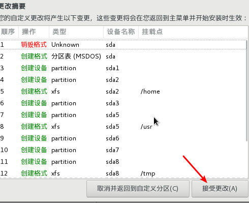

# 1. linux学习环境搭建

>我们一般情况下不会真的去安装一个Linux系统，说把我的win干掉，而是通过虚拟机的方式来安装一个系统即可。
>
>---

## 1. Virtual box安装

基本上一路下一步就可以了

后面一路下一步就可以了。

## 2.  centos7的安装

软件需要：

我们安装采用最小安装，因为我们不用桌面，不适用图形，虽然你一开始有点难受，但是难受其实也是一种享受。

接下来看图

### 1. 安装

### 2. 配置

### 3. 启动

启动前我们做一个工作，设置一个快捷键

==通过上下移动到Install Centos7==

### 4. 虚拟系统位置

C:\Users\Administrator\VirtualBox VMs\centos7-hadoop  也可以自行制定

### 5. 分区配置

继续添加

剩下的如下：

然后点击完成，密码由于很简单，需要点击两次

。

然后下载294个依赖包，静静的等待吧。

下载完之后重启，然后选择第一项回车即可。

