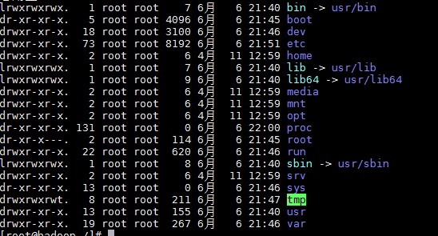
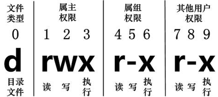
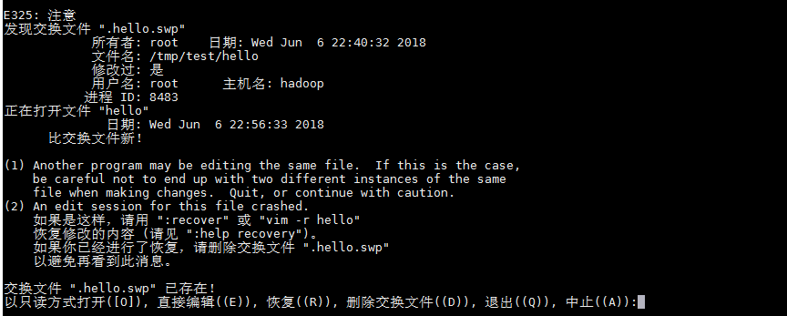

# 1. linux当中文件的简单认识


Linux系统是一种典型的多用户系统，不同的用户处于不同的地位，拥有不同的权限。为了保护系统的安全性，Linux系统对不同的用户访问同一文件（包括目录文件）的权限做了不同的规定。

在Linux中我们可以使用ll或者ls –l命令来显示一个文件的属性以及文件所属的用户和组，如：




什么意思呢？

"d"在Linux中代表该文件是一个目录文件。

在Linux中第一个字符代表这个文件是目录、文件或链接文件等等


- 当为[ *d* ]则是目录
- 当为[ *-* ]则是文件；
- 若是[ *l* ]则表示为链接文档(link file)；
- 若是[ *b* ]则表示为装置文件里面的可供储存的接口设备(可随机存取装置)；
- 若是[ *c* ]则表示为装置文件里面的串行端口设备，例如键盘、鼠标(一次性读取装置)。


看上面的图，我们基本就知道什么意思了。


接下来的字符中，以==三个为一组==，且均为『rwx』 的三个参数的组合。其中，[ r ]代表可读(read)、[ w ]代表可写(write)、[ x ]代表可执行(execute)。 要注意的是，这三个权限的位置不会改变，如果没有权限，就会出现减号[ - ]而已 。

每个文件的属性由左边第一部分的10个字符来确定 



可以看到linux是轻松实现了组和用户等权限设计滴滴滴。


第0位确定文件类型，第1-3位确定属主（该文件的所有者）拥有该文件的权限。

第4-6位确定属组（所有者的同组用户）拥有该文件的权限，第7-9位确定其他用户拥有该文件的权限。

其中，第1、4、7位表示读权限，如果用"r"字符表示，则有读权限，如果用"-"字符表示，则没有读权限；

第2、5、8位表示写权限，如果用"w"字符表示，则有写权限，如果用"-"字符表示没有写权限；第3、6、9位表示可执行权限，如果用"x"字符表示，则有执行权限，如果用"-"字符表示，则没有执行权限。

我们作为开发人员对于linux认识到这些就够了， 如果是运维人员当然是远远不够的，为什么我不讲这么多呢？

- 表面原因是，我不想大家去做运维去了
- 真是原因是，讲这个很无聊噻。


下面我们还是说点我们日常工作经常打交道的东西，就是bash.

# 2. 命令从我做起

linux的灵魂就是它的无比强大的命令，当然你想全部都会是不可能的，经过贫道统计，常用的也就100来个，超级常用的也就那么十来个，所以就学这一招就够了，其它的用的时候再查询。


## 1. 文件与目录相关的命令

- ls: 列出目录
- cd：切换目录
- pwd：显示目前的目录
- mkdir：创建一个新的目录
- rmdir：删除一个空的目录
- cp: 复制文件或目录
- rm: 移除文件或目录
- touch 创建一个文件并且编辑


编辑器之vi  vs vim

对于简单的编辑工作vi够用了，如果复杂点，那就上vim


# 3 vi 

首先要搞明白，无论是vi还是vim，基本上 vi/vim 共分为三种模式，分别是**命令模式（Command mode）**，**输入模式（Insert mode）**和**底线命令模式（Last line mode）**。 这三种模式的作用分别是： 


### 命令模式：

用户刚刚启动 vi/vim，便进入了命令模式。

此状态下敲击键盘动作会被Vim识别为命令，而非输入字符。比如我们此时按下i，并不会输入一个字符，i被当作了一个命令，我猜测是input的意思，错了就当我胡说八道哈。

以下是常用的几个命令：

- **i** 切换到输入模式，以输入字符。
- DD 一行就冒得了
- **x** 删除当前光标所在处的字符。
- **:** 切换到底线命令模式，以在最底一行输入命令。

若想要编辑文本：启动Vim，进入了命令模式，按下i，切换到输入模式。

命令模式只有一些最基本的命令，因此仍要依靠底线命令模式输入更多命令。

### 输入模式

在命令模式下按下i就进入了输入模式。

在输入模式中，可以使用以下按键：

- **字符按键以及Shift组合**，输入字符
- **ENTER**，回车键，换行
- **BACK SPACE**，退格键，删除光标前一个字符
- **DEL**，删除键，删除光标后一个字符
- **方向键**，在文本中移动光标
- **HOME**/**END**，移动光标到行首/行尾
- **Page Up**/**Page Down**，上/下翻页
- **Insert**，切换光标为输入/替换模式，光标将变成竖线/下划线
- **ESC**，退出输入模式，切换到命令模式

### 底线命令模式

在命令模式下按下:（英文冒号）就进入了底线命令模式。

底线命令模式可以输入单个或多个字符的命令，可用的命令非常多。

在底线命令模式中，基本的命令有（已经省略了冒号）：

- q 退出程序
- w 保存文件

按ESC键可随时退出底线命令模式。


掌握这些基本用法，对于VI来讲你已经可以了。


# 4. vim

乡亲们and同学们，如果vi还满足不了你，vim一定能让你大显神威，没错，无数人标榜自己会vim，然后就以为自己上了个天。。。

就一个破编辑器的用法，哪来的优越感。我们不做这种lowzer


> 忠告：vim的学习与适用，必须通过大量实战，你才能如鱼得水~不要成为水货。
>
> ---


## 1. vim的安装


如果我们直接vim一个文件出现未找到命令的话。

- 先查看下

```bash
rpm -qa |grep vim  
```

比如以我的测试环境来看只有：

vim-minimal-7.4.160-4.el7.x86_64


证明少了东西

正常来讲有三个

`vim-enhanced-**`

`vim-minimal-*`

`vim-common-*l5`


==直接一招搞定==

```bash
yun -y install vim
```


然后我们去vim一个文件，如果能看到下面的美女，代表你成功了。




我们拿个md文件来做实验呗


## 2. 光标移动

在命令模式下

**单个字符操作**

- `h` 向左一字符
- `j` 下一行
- `k` 上一行
- `l` 向右一字符


**单词操作**

- `w` or `W` 向右移动到下一单词开头  
- `e` or `E` 向右移动到单词结尾
- `b` or `B` 向左移动到单词开头

我又开始猜测型翻译了

w word下一个单词

e end 最后面

b back退回到最前面


**块级操作**


- `gg` 到文档第一行
- `G` 到文档最后一行
- `0` 到行首（第 1 列）
- `^` 到第一个非空白字符
- `$` 到行尾
- `Ctrl-d` 向下移动半页
- `Ctrl-u` 向上移动半页
- `Ctrl-f` 向下移动一页
- `Ctrl-b` 向上移动一页
- `:<N>` or `<N>gg` 跳转到第 N 行
- `:+<N>` or `<N>j` 向下跳 N 行
- `:-<N>` or `<N>k` 向上跳 N 行


