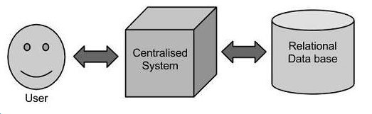
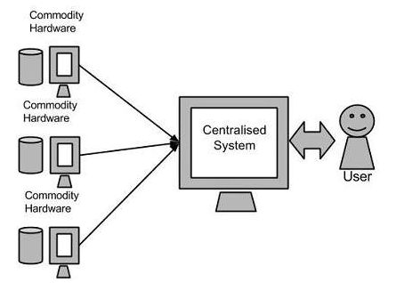
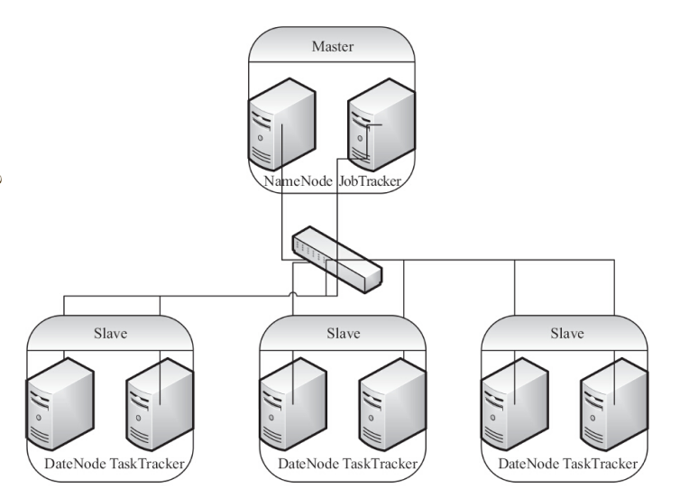
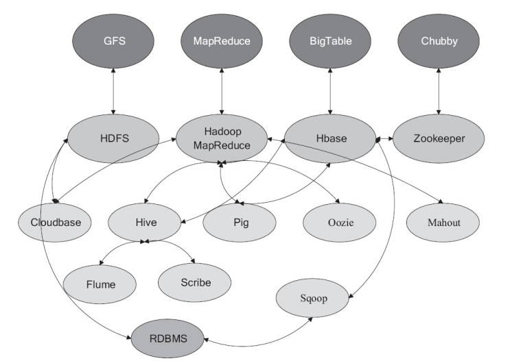
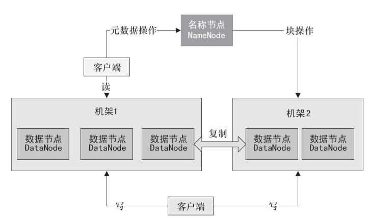

# 1. 大数据简介

> 从前现在过去了再不来
>
> 红红落叶长埋尘土内
>
> 开始终结总是没变改
>
> 天边的你飘泊白云外
>
> 苦海翻起爱恨
>
> 在世间难逃避命运
>
> 相亲竟不可接近
>
> 或我应该相信是缘份
>
> 情人别后永远再不来
>
> 无言独坐放眼尘世外
>
> 鲜花虽会凋谢
>
> 但会再开
>
> 一生所爱隐约
>
> 在白云外
>
> 苦海翻起爱恨
>
> 在世间难逃避命运
>
> 相亲竟不可接近
>
> 或我应该相信是缘份
>
> 苦海翻起爱恨
>
> 在世间难逃避命运
>
> 相亲竟不可接近
>
> 或我应该相信是缘份
>
> ​	~大话西游插曲《一生所爱》 
>
> ​      ==不知道经过了多少个五百年，我们才相遇java，所以一定要好好学习。==
>
> 
>
> ---

## 1. 什么是大数据

我们来看看wiki的定义：

https://zh.wikipedia.org/wiki/%E5%A4%A7%E6%95%B8%E6%93%9A

## 2. 总结出来大数据的几个特点

### 1. 传统解决方案

### 2. 谷歌的解决方案

## 3. Hadoop又是什么

​	Hadoop是根据谷歌公司发表的MapReduce和Google文件系统的论文自行实现而成。所有的Hadoop模块都有一个基本假设，即硬件故障是常见情况，应该由框架自动处理。 该项目现在在Apache下面进行维护，官方网站是：http://hadoop.apache.org/

目前最新版本为Release 3.0.2 available，企业里面应该最新版本不会超过2.7，所以我们将版本限定不超过2.7. 其实有的公司可能都还在适用Hadoop1.x。

Hadoop作者：Doug Cutting, 2005年开始一个名为HADOOP的开源项目，道格命名为他的儿子的玩具大象 作为项目名称。

我们生活在数据时代，存储数据的总量是不容易的。

电子化，但一个IDC估计把“数字宇宙”的大小放在4.4个Zeta表中

## 4. Hadoop的架构

​	首先Hadoop要做的事情是使用简单的编程模型在计算机集群中分布式处理大型数据集。Hadoop框架式应用程序在跨计算机群集提供分布式存储和计算的环境中工作。Hadoop旨在从单个服务器扩展到数千台机器，每台机器提供本地计算和存储。 

然后我们看看Hadoop的架构

- Hadoop Common
- Hadoop Yarn
- hdfs
- MapReduce

Hadoop本质上可以说是起源与Google的集群系统，Google的数据中心适用了廉价的linux PC组成集群。Google采集系统的核心的组件有两个。

- GFS
- MapReduce

GFS：GoogleFIleSYstem，一个分布式文件系统，隐藏下层负载均衡，冗余复制等细节，对上层提供一个统一的文件系统API接口。

MapReduce：计算模型，谷歌发现大多数的分布式运算可以抽象为MapReduce操作，Map是把输入input分解成为中间的KEY Value对，Reduce把Key Value 合成为最终的输出output，这两个函数由程序员提供给系统，下层设施负责把map和reduce操作分布在集群上运行，并把结果存储在GFS上，Hadoop是Google集群系统的一个java开源实现。

Hadoop实现了HDFS文件系统和MapReduce，使得Hadoop成为一个分布式的计算平台，用户只需要分别实现map和reduce，并注册job既可以自动分布式运行，因此Hadoop并不仅仅是一个用于存储的分布式文件系统，而是用于通用计算机设备组成的大型集群上执行分布式应用程序的框架。如今我们讲Hadoop从狭义和广义来讲分别所指不同。

- 狭义：HDFD和MapReduce，一种典型的MS架构

Hadoop由一个master逻辑节点和多个slave逻辑节点构成,master逻辑节点由namenode和jobtranker组成，namenode是hdfs的master，主要负责Hadoop分布式文件系统元数据的管理工作，jobtraciker是MapReduce的master，主要负责启动 跟踪 调度各个tasktracker的任务执行，每个slave逻辑节点通常同事具有datanode以及tasktracker功能，tasktracker根据应用要求来结合本地数据执行map任务和reduce任务。

- 广义的Hadoop

其实指代的已经Hadoop整个生态圈。

比如

- pig
- hive
- sqoop
- flume
- hbase
- etc...

##  4. HDFS

数据存储是由HDFS负责， 它具备如下特点

- 对于整个集群有一个单一的命名空间
- 数据一致性，适合一次写多次读模型
- 文件会被分割为多个文件筐，每个文件筐呗分配到存储到数据节点上，而且根据配置会有赋值文件来保证数据的安全性。

### 1. 三个重要角色

- 名称节点 namenode
- 数据节点datanode
- 客户端

namenode是HDFS当中的管理者，主要负责管理文件系统的命名空间，集群配置信息，存储块的赋值，namenode会存储文件系统的metadata在内存中，这些信息，包含文件信息，即每一个文件对应的文件块的信息，以及每一个文件筐在datanode的信息。

datanode是文件存储的基本单元，它讲block存储在本地文件系统种，保存了block的metadata,然后周期性发送所有存在的block的报告给namenode,client就是需要获取分布式文件系统文件的应用程序，数据存储种的读取和写入过程如下图：

分析：

- client向Namenode发起文件写入的请求
- Namenode根据文件的大小和文件块配置情况，向client返回它所管理的Datanode信息
- Client把文件分为多个Block，根据Datanode的地址信息，按顺序写入每一个Datanode。

HDFS读取流程：

- client向Namenode发起文件读取的请求
- Namenode返回文件存储的Datanode信息
- Client读取文件信息

HDFS复制文件块流程：

- Namenode发现部分的Block不符合最小复制数或部分Datanode失效
- 通知Datanode相互复制Block
- Datanode开始相互复制。

通过上面的分析，相信大家已经一头雾水，学习大数据确实有许多概念需要去理解，毕竟它远远不同于过去的解决思路，它是一种新的思想，所以思路也需要跟着改变。

下一节我们通过一个最简单的环境搭建来入门体验。

