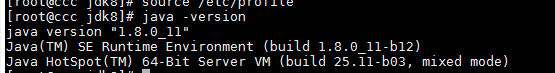

# 一、 Hadoop入门环境搭建


基础约束：

- centos7
- JDK8
- hadoop2.7


# 二、 JDK8的安装

## 1 . 切换目录

```bash
cd /usr/local

```

## 2. 下载wget

```bash
 yum -y install wget

```

## 3. 下载

```bash
wget --no-cookies --no-check-certificate --header "Cookie: gpw_e24=http%3A%2F%2Fwww.oracle.com%2F; oraclelicense=accept-securebackup-cookie" "http://download.oracle.com/otn-pub/java/jdk/8u171-b11/512cd62ec5174c3487ac17c61aaa89e8/jdk-8u171-linux-x64.tar.gz"
```


## 4. 解压

```bash
tar -zxvf jdk-8u11-linux-x64.tar.gz

```


## 5. 重命名

```bash
mv jdk1.8.0_11/   jdk8

```


## 6. 配置环境变量

现在我们输入java -version肯定是没有反应的

```bash
vi /etc/profile


```


然后在文件后面追加内容如下：

```bash

export JAVA_HOME=/usr/local/jdk8
export PATH=$PATH:$JAVA_HOME/bin

```


最后让修改生效

```bash
source /etc/profile
```


验证

```bash
java -version

```



能看到代表就成功了。


# 三、 Hadoop的安装

## 1. 切换目录

同上

## 2. 下载Hadoop

```bash
wget http://mirror.bit.edu.cn/apache/hadoop/common/hadoop-2.7.6/hadoop-2.7.6.tar.gz 
```


## 3. 解压Hadoop

```bash
tar -zxvf  hadoop-2.7.6.tar.gz

```


## 4 SSH设置和密钥生成

SSH需要在集群上执行不同的操作，例如启动，停止，分布式守护进程shell操作。要验证Hadoop的不同用户，需要为Hadoop用户提供公钥/私钥对，并与不同的用户共享。

以下命令用于使用SSH生成键值对。将公钥从id_rsa.pub复制到authorized_keys，并为owner分别提供对authorized_keys文件的读写权限。

以下代码直接复制执行即可，官网给的

```bash
ssh-keygen -t rsa 
cat ~/.ssh/id_rsa.pub >> ~/.ssh/authorized_keys 
chmod 0600 ~/.ssh/authorized_keys 
```


基础环境至此搭建完毕。


