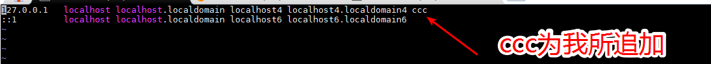

> Hadoop的操作模式分为三种
>
> - 单机
> - 伪分布式
> - 完全分布式
>
> ---


# 一、 单机


## 1. 配置Hadoop环境变量

参照之前的JDK操作即可

## 2. 验证

```bash
hadoop version
```

如果出现如图则成功


# 二、 单机实例

为了做这个实验，我们在根目录下的tmp下创建htest测试目录

## 1. 目录准备

然后在这个目录下在创建一个输入目录

```bash
cd /
cd tmp
mkdir htest
cd htest
mkdir input

```

## 2. 复制文件

讲Hadoop之下的所有txt文件复制过来


## 3. 计算

利用Hadoop进程来计算输入目录中所有可用文件中的单词总数 

```bash
 hadoop jar $HADOOP_HOME/share/hadoop/mapreduce/hadoop-mapreduce-examples-2.7.6.jar wordcount input output

```


## 4. 启动报错问题

由于名字修改了的缘故，会导致hadoop无法识别主机名

INFO metrics.MetricsUtil: Unable to obtain hostName
java.net.UnknownHostException: bogon: bogon: unknown error


解决方案：

修改hosts 添加我们自定义的hostname，比如我这里适用的是ccc




**重启网络**

```bash
systemctl restart network.service
```


重新执行命令：


```bash
 hadoop jar $HADOOP_HOME/share/hadoop/mapreduce/hadoop-mapreduce-examples-2.7.6.jar wordcount input output
```


能看到如下信息代表成功：


## 5. 查看计算结果

```bash
cat output/*
```

结果如下：


## 6. 简单分析

看日志分析

注意我们刚才通过wordcount这个程序来完成这个工作的。


