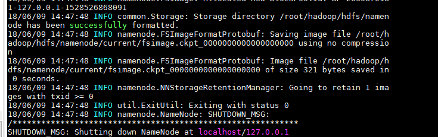
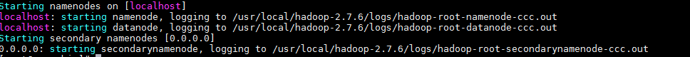
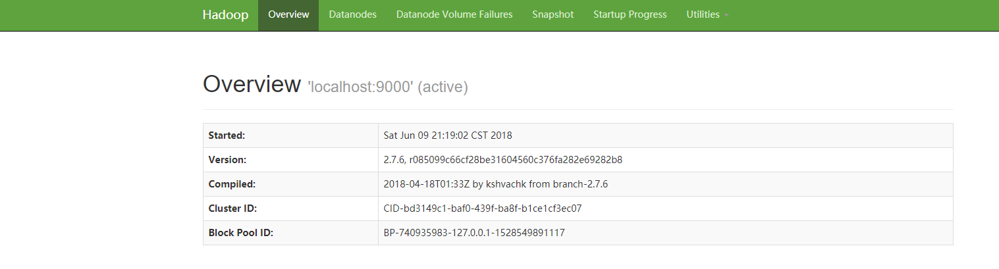
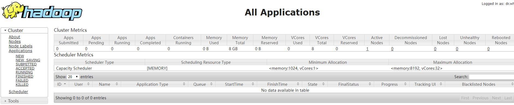

> 伪分布式环境搭建
>
> ---


# 一、 伪分布式环境搭建

基础设施：

基本的环境变量JDK Hadoop的HOME目录自行设置


在java当中开发hadoop程序，必须通过javaHOME值替换系统中java的配置

重置hadoop-env.sh文件中的java环境变量


## 1. 切换目录

```bash
 cd /usr/local/hadoop-2.7.6/etc/hadoop/

```


## 2. 编辑hadoop-env.sh

```bash
vim hadoop-env.sh
```


## 3. 编辑core-site.xml 

​	这个文件包含信息，诸如读/写缓冲器的用于Hadoop的实例的端口号，分配给文件系统的存储器，存储器限制，用于存储数据，和大小。 

打开core-site.xml并在<configuration></ configuration>标记之间添加以下属性 

```xml
   <property>
      <name>fs.default.name</name>
      <value>hdfs://localhost:9000</value> 
   </property>
 
```


## 4. 编辑**HDFS-site.xml** 

在**HDFS-的site.xml**文件中包含的信息，如复制数据的价值，名称节点的路径，本地文件系统的数据节点的路径。 

打开此文件并在该文件的<configuration> </ configuration>标记之间添加以下属性。 

这里我们就放在root的home下

```bash
cd /tmp
mkdir hdfs

```


```xml

   <property>
      <name>dfs.replication</name>
      <value>1</value>
   </property>
    
   <property>
      <name>dfs.name.dir</name>
      <value>file:///root/hadoop/hdfs/namenode </value>
   </property>
    
   <property>
      <name>dfs.data.dir</name> 
      <value>file:///root/hadoop/hdfs/datanode </value> 
   </property>
```


## 5. 修改**yarn-site.xml** 

打开yarn-site.xml文件并在该文件的<configuration>，</ configuration>标记之间添加以下属性。 

```xml
 <property>
      <name>yarn.nodemanager.aux-services</name>
      <value>mapreduce_shuffle</value> 
</property>
```


## 6. 编辑**mapred-site.xm** 

​	该文件用于指定我们正在使用的MapReduce框架。默认情况下，Hadoop包含一个yarn-site.xml模板。首先，需要使用以下命令将文件从**mapred-site.xml.template**复制到**mapred-site.xml**文件。 


```bash
cp mapred-site.xml.template mapred-site.xml 
```


然后打开mapred-site.xml文件，并在该文件的<configuration>，</ configuration>标记之间添加以下属性 。

```xml
<property> 
    <name>mapreduce.framework.name</name>
    <value>yarn</value>
</property>
```


## 7. 验证

### 1）名称节点设置

格式化名称节点

hdfs namenode -format

看到下面代表成功：





### 2）验证HDFS

启动dfs。

启动可能报错，对于ssh免密登录问题。

 执行如下命令

```bash
ssh  -o StrictHostKeyChecking=no root@localhost

ssh  -o StrictHostKeyChecking=no root@0.0.0.0

ssh  -o StrictHostKeyChecking=no username@xxx.xxx.xxx.xx
```

看到下面的内容，**代表成功了**





### 3）启动yarn

```bash
./start-yarn.sh
```


### 4）访问测试

访问Hadoop的默认端口号是50070.可以通过URL访问查看。

http://192.168.56.200:50070/dfshealth.html#tab-overview


几个设置问题：

修改hdfs-site.xml

添加内容：

```xml
<property>
  <name>dfs.http.address</name>
  <value>0.0.0.0:50070</value>
</property>

```


修改/etc/hosts

注释127.0.0.1

重新配置

192.168.56.200 localhost hadoop1

重新启动，

如果重新启动不行，重新格式化namenode


再不行，检查是否是防火墙的问题


如果能有如下界面，则成功：




访问群集的所有应用程序的默认端口号是8088 

http://192.168.56.201:8088




## 8 防火墙问题

- 查看防火墙状态 

```bash
systemctl status firewalld
```


- 关闭防火墙

```bash
systemctl stop firewalld.service

```


- 关闭开机制动启动 

```bash
systemctl  disable firewalld.service
```


