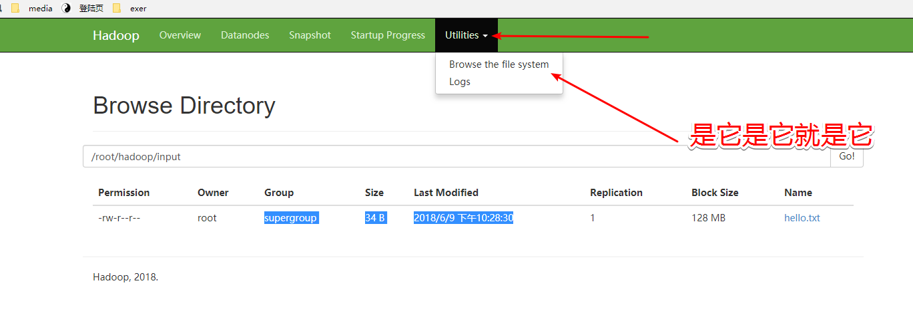
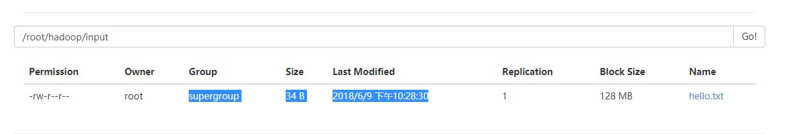

# 一、HDFS概述

Hadoop文件系统是使用分布式文件系统设计开发的。它在商品硬件上运行。与其他分布式系统不同，HDFS具有高度容错性，并使用低成本硬件设计。 

HDFS的功能：

- 分布式存储和处理
- 命令交互
- namenode和Datanode内置服务帮助检查集群
- 流式访问文件系统数据
- 文件权限和认证


# 二、HDFS体系

namenode 充当老大，负责以下任务

- 管理文件系统命名空间
- 规范客户对文件的访问
- 执行文件系统操作，重命名，关闭和他开文件和目录


Datanode

集群中的每个节点（商品硬件/系统），都会有一个datanode。这些节点管理其系统的数据存储。 它负责的工作

- 根据客户端其你去，Datanode在文件系统上执行读写操作
- 根据老大的命令执行创建 删除 复制等操作。

# 三、 HDFS的期望

- 故障检测和回复
- 处理海量数据
- 高效（比如数据临近减少网络流量提高吞吐）


# 四、HDFS的一些shell操作

假设我们已经对Namenode格式化，启动了HDFS。

Hadoop文件系统（FS）默认提供了各种shell命令，可用于与Hadoop分布式文件系统（HDFS）或任何其他使用Hadoop Shell的支持文件系统进行交互。 一些最常用的命令是曾经用于诸如创建目录，复制文件，查看文件内容，更改文件的所有权或权限等操作。 


## 1. 查看

使用'ls'来查找目录中文件的列表，文件的状态。 

```bash
hadoop fs -ls /

```


## 2. 创建文件夹

```bash
hadoop fs -mkdir /root/hadoop/input2
```

没看到消息就是好消息


## 3. 存储文件

比如我们创建一个本地文件然后提交的HDFS当中

```bash
hadoop fs -put /tmp/htest/hello.txt /root/hadoop/input
```


## 4. 检索数据

```bash
 hadoop]# hadoop fs -cat /root/hadoop/input/hello.txt

```


## 5. get到本地

从HDFS系统当中get到本地

```bash
hadoop fs -get /root/hadoop/input/hello.txt /tmp/

```


## 6. 图形界面验证






## 7. 停止hdfs与yarn


 进入sbin目录

```bash

./stop-yarn.sh

./stop-dfs.sh
```


注意yarn停掉不影响HDFS

不过当hdfs停掉之后就无法访问了。

更多的shell操作可以参考：https://hadoop.apache.org/docs/r2.7.6/hadoop-project-dist/hadoop-common/FileSystemShell.html


